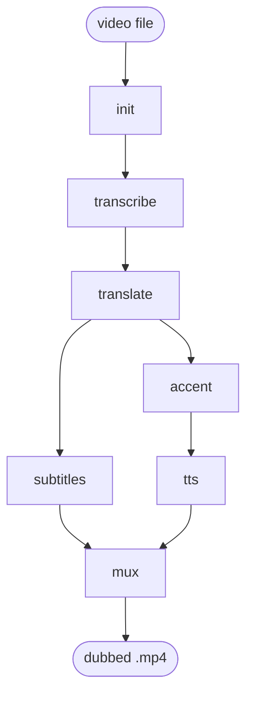

# GLAM

**Glossary-Locked Audio Muxer** — a command-line tool that translates a local video
into another language, producing translated subtitles and a dubbed audio track, then
muxing them back into the video.

GLAM is built for technical and educational content — talks, lectures, tutorials — where
ordinary machine translation mangles the jargon. You give it a glossary of terms that must
stay untranslated or be rendered a specific way (`loss`, `embedding`, `Kubernetes`, …),
and GLAM keeps them locked across the whole translation.

## How it works

The pipeline runs locally as a series of small, resumable steps. Each step reads and writes
plain files in a job folder, so you can inspect, rerun, or fix any stage in isolation.



- **init** — register a job, extract the audio, copy in your glossary
- **transcribe** — speech-to-text of the source audio
- **translate** — glossary-locked translation of the transcript with an LLM
- **subtitles** — render the translation to an `.srt` file
- **accent** — optional per-language text fixes for dubbing (currently Russian stress marks)
- **tts** — synthesize a dubbed audio track
- **mux** — combine source video, dubbed audio, and subtitles into the final `.mp4`

`ffmpeg` handles the media work locally. Transcription, translation, and speech synthesis
are called over HTTP, so the models can run on your own machine, a self-hosted server, or a
commercial API — you only change the config, never the pipeline.

## Requirements

- Linux, Python **3.10+**, and [`uv`](https://docs.astral.sh/uv/)
- `ffmpeg` and `ffprobe` on your `PATH`
- Reachable model endpoints for the steps you run:
  - a transcription (ASR) endpoint,
  - a chat-completion endpoint for translation,
  - a text-to-speech endpoint for dubbing.

Endpoints can speak the **OpenAI-compatible** API (`protocol: openai`) or a supported native
protocol (for TTS, `protocol: chatterbox`).

## Install

```bash
git clone <this-repo> glam && cd glam
uv sync
```

This creates a virtual environment and installs GLAM. Run commands with `uv run glam …`
(the examples below use that form).

## Configure

GLAM reads a YAML config, by default from `~/.glam.yaml` (override with `-c/--config`).
Copy the example and edit the endpoints:

```bash
cp conf/config.example.yaml ~/.glam.yaml
```

A minimal config:

```yaml
job_dir: ./jobs

# Used by `init` when you omit --source / --target.
defaults:
  source: en
  target: ru

services:
  - name: transcribe
    protocol: openai
    url: http://<inference-host>:8000/v1
    params:
      model: Systran/faster-whisper-large-v3

  - name: translate
    protocol: openai
    url: http://<inference-host>:11434/v1
    params:
      model: qwen2.5:14b
      api_key: MY_SECRET_KEY   # optional; omit for keyless local servers

  - name: tts
    protocol: chatterbox
    url: http://<inference-host>:8004
```

See `conf/config.example.yaml` for all options, including an OpenAI-compatible TTS
alternative.

## Quick start

Translate a video end to end (the job id is derived from the filename — here `lecture`):

```bash
uv run glam init lecture.mp4 --glossary glossary.json   # prints the job id, here "lecture"
uv run glam transcribe --job-id lecture
uv run glam translate  --job-id lecture
uv run glam subtitles  --job-id lecture
uv run glam accent     --job-id lecture   # Russian only: adds stress marks for the dubbing
uv run glam tts        --job-id lecture
uv run glam mux        --job-id lecture
```

The result lands in the job folder as `lecture.mp4`, with a `result.mp4` symlink pointing
to it.

Every step is **idempotent**: rerun it and it skips work that is already done. Pass
`--force` to recompute a step.

## The glossary

The glossary is the whole point of GLAM. Pass it to `init` with `--glossary`. It can be:

- a JSON array of terms to keep verbatim — `["Kubernetes", "pod", "loss"]`
- a JSON object mapping a term to its required translation — `{"pod": "под", "node": "нода"}`
- a plain-text file, one term per line (`#` comments and blank lines ignored)

During translation the model is instructed to apply these rules strictly, so protected
terms never drift.

## Languages and voices

- Set the target with `--target <lang>` on `translate`, `subtitles`, and `tts`
  (it falls back to the job's target, then to `defaults.target`).
- Translations into several languages coexist in one job — artifacts are named per language
  (`translation.ru.json`, `subtitles.de.srt`, `tts.ru.wav`, …).
- For Russian, run `accent` before `tts`: it writes `translation.ru.fixed.json` with stress marks,
  and `tts` picks that up automatically (subtitles keep using the plain translation). You can
  hand-edit the `.fixed.json` to correct any misplaced stress before dubbing.
- Choose a dubbing voice with `--voice` on `init` (stored with the job) or on `tts`. Omit it
  to use the server's default voice. Give the voice name without a file extension (e.g. `Michael`);
  the chatterbox backend appends `.wav` when it builds the server's voice id.
- `mux` picks up every `tts.*.wav` and `subtitles.*.srt` in the job and adds them all as
  labeled tracks; use `--exclude <artifact>` to leave one out.

## Job folder

Each job is a self-contained folder under `job_dir`:

```text
jobs/<job-id>/
  job.yaml              # job manifest
  source.mp4            # link to the input video
  audio.wav             # extracted audio
  glossary.json         # normalized glossary
  transcript.json       # transcribe output
  translation.<lang>.json
  translation.<lang>.fixed.json    # accent step (e.g. Russian stress), if run
  subtitles.<lang>.srt
  tts.<lang>[.<voice>].wav
  <name>.mp4            # final muxed video
  result.mp4            # symlink to the latest result
```

Because everything is a file, you can open any intermediate artifact, tweak it, and rerun
the downstream steps.

## Command reference

```bash
uv run glam init <video> [--source LANG] [--target LANG] [--glossary PATH] [--voice V] [--job-id ID] [--force]
uv run glam transcribe --job-id ID [--force]
uv run glam translate  --job-id ID [--target LANG] [--batch-size N] [--context-size N] [--dump] [--force]
uv run glam subtitles  --job-id ID [--target LANG] [--force]
uv run glam accent     --job-id ID [--target LANG] [--force]
uv run glam tts        --job-id ID [--target LANG] [--voice V] [--force]
uv run glam mux        --job-id ID [--exclude ARTIFACT]... [--force]
```

All commands accept `-c/--config PATH`. `--dump` on `translate` writes the raw model
exchanges into `translate.<lang>.dump/` for debugging.

## Learn more

Architecture, backend design, and per-step specifications live in [`docs/`](docs/):

- [`docs/architecture.md`](docs/architecture.md) — how the pipeline and backends fit together
- [`docs/steps/`](docs/steps/) — a detailed spec for each step
