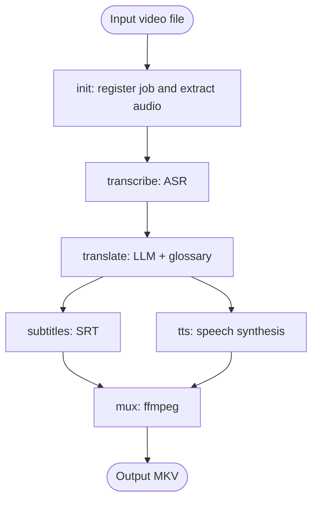

# GLAM

Glossary-Locked Audio Muxer: a CLI pipeline for translating local video files into Russian or another target language, with technical terms protected by a glossary.

GLAM is designed for technical and educational videos where generic machine translation often gets important jargon wrong. The pipeline transcribes the source audio, translates the transcript with an LLM while preserving selected terms, generates subtitles and a dubbed audio track, then muxes everything back into the video.

## Pipeline



The CLI runs locally and uses `ffmpeg` for media work. ASR, LLM translation, and TTS are called over HTTP through OpenAI-compatible endpoints, so model backends can be local, self-hosted, or commercial without changing pipeline code.

## Goals

- Translate local video files into dubbed audio and translated subtitles.
- Preserve technical vocabulary such as `loss`, `inference`, `embedding`, `batch`, and similar terms.
- Keep every pipeline step idempotent and file-based.
- Cache outputs by backend/model so different model runs can coexist.
- Allow model providers to be swapped through configuration only.

## Non-goals

- GLAM does not download videos. It expects a local video file as input.
- GLAM does not require local GPU access on the runner machine. Model inference can run elsewhere.
- GLAM is not tied to one ASR, LLM, or TTS provider.

## CLI

Planned command shape:

```bash
glam init <video_file> [--id ID]
glam transcribe <video_id> [-c config.yaml]
glam translate <video_id> --lang ru [-c config.yaml]
glam subtitles <video_id> --lang ru
glam tts <video_id> --lang ru [-c config.yaml]
glam mux <video_id> --lang ru [--hardsub]
glam run <video_file> --lang ru [-c config.yaml]
```

`glam run` executes the full pipeline and skips cached steps unless forced.

## Job Layout

Each video is stored under a job directory keyed by `video_id`:

```text
jobs/<video_id>/
  meta.json
  source.mp4
  audio.wav
  transcript.<asr_model>.json
  translation.<lang>.<model>.json
  subtitles.<lang>.<model>.srt
  tts_segments.<lang>.<tts_model>.<voice>/
  tts_track.<lang>.<tts_model>.<voice>.wav
  output.<lang>.mkv
```

Outputs include the relevant model or backend in the filename. Re-running a step with a different model creates a new file instead of replacing the old one.

## Configuration

Example `config.yaml`:

```yaml
target_lang: ru
source_lang: en

steps:
  asr:
    backend: openai_compatible
    base_url: http://<inference-host>:8000/v1
    model: Systran/faster-whisper-large-v3
    api_key_env: LOCAL_API_KEY

  translate:
    backend: openai_compatible
    base_url: http://<inference-host>:11434/v1
    model: qwen2.5:7b
    api_key_env: LOCAL_API_KEY
    glossary: ./glossary.yaml

  tts:
    backend: openai_compatible
    base_url: http://<inference-host>:PORT/v1
    model: xtts-v2
    voice: default
    api_key_env: LOCAL_API_KEY

mux:
  keep_original_audio: true
  hardsub: false
```

Example glossary:

```yaml
never_translate:
  - loss
  - inference
  - distribution
  - gradient
  - embedding
  - batch
  - epoch
  - overfitting
```

## Requirements

- Linux shell environment.
- `ffmpeg` and `ffprobe`.
- OpenAI-compatible ASR endpoint, for example a Whisper-compatible service.
- OpenAI-compatible chat completion endpoint for translation.
- OpenAI-compatible TTS endpoint for dubbing.
- Python dependencies for subtitle handling, such as `pysubs2`, once the implementation scaffold is added.

Before wiring a backend into the config, verify that it exposes the required OpenAI-compatible endpoint and is reachable from the machine running the CLI.

## Design Principles

- **Idempotent steps.** A step skips work when its expected output already exists, unless `--force` is used.
- **No silent overwrites.** Cached outputs are model-specific and kept side by side.
- **Provider-neutral model calls.** ASR, translation, and TTS use OpenAI-compatible API shapes.
- **Glossary-first translation.** The glossary is a core feature, not an optional post-processing detail.
- **Explicit files between steps.** Each step reads and writes concrete files, making debugging and reruns simple.

## Current Status

This repository currently describes the intended architecture and command interface. The next implementation milestones are:

1. Add the project scaffold, config schema, and CLI entry point.
2. Implement `init` with `ffprobe` metadata extraction and `ffmpeg` audio extraction.
3. Wire ASR to an OpenAI-compatible transcription endpoint.
4. Implement glossary-aware translation with batch alignment.
5. Generate SRT subtitles with reading-speed-aware segmentation.
6. Add TTS generation, duration fitting, and track assembly.
7. Mux original video, original audio, dubbed audio, and subtitles into MKV.

## Architecture Notes

The longer architecture document covers backend choices, job caching, TTS duration synchronization, muxing decisions, and open questions around orchestration.
