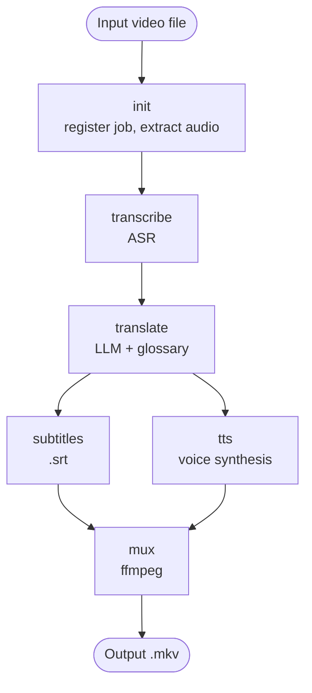
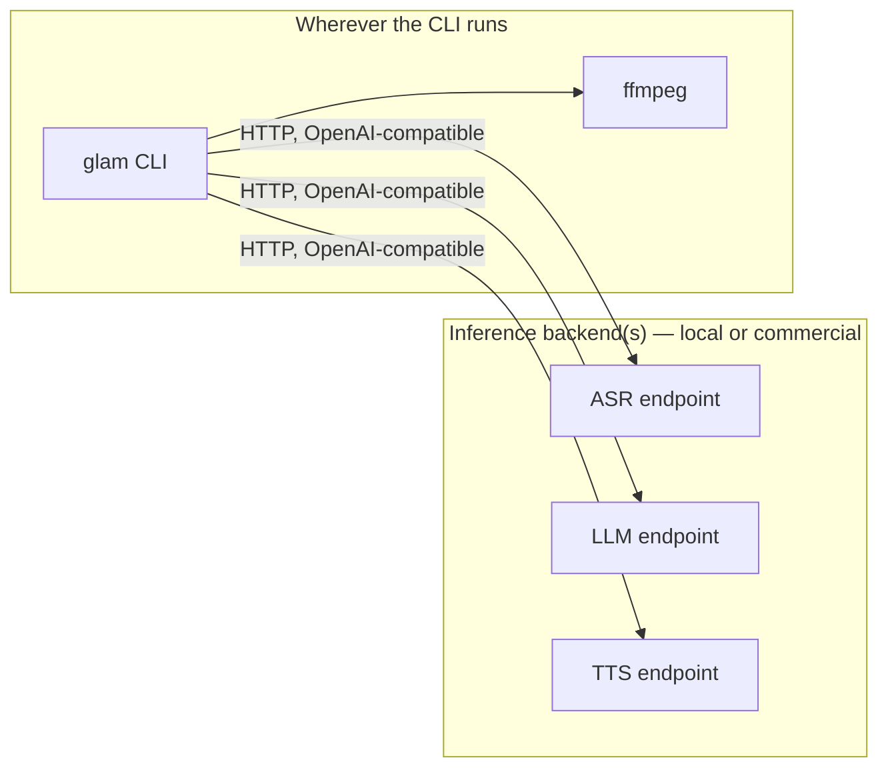

# GLAM — Architecture

GLAM (Glossary-Locked Audio Muxer) — video translation pipeline: ASR → LLM translation with a technical-glossary system → subtitles + TTS dubbing → mux.

Last updated: 2026-07-01

## Goals

- Translate videos (primarily English-source technical/educational content) into Russian or another target language, producing translated subtitles and a dubbed audio track.
- Motivation: (1) not everything is translated by content platforms; (2) generic machine translation (e.g. Google) frequently mistranslates technical jargon literally — *loss*, *inference*, *distribution* — where practitioners expect the English term preserved.
- Every model-backed step must be swappable between the local cluster and a commercial API without touching pipeline code — configuration only.

## Pipeline overview



## Design principles

1. **OpenAI-compatible protocol for all model-backed steps.** ASR, translation, and TTS are called over HTTP using the OpenAI API shape (`/v1/audio/transcriptions`, `/v1/chat/completions`, `/v1/audio/speech`). This is what self-hosted inference servers (Ollama, vLLM, TGI, most Whisper/TTS wrappers) speak natively, and it's OpenAI's own native format. Swapping a backend is a config change (`base_url`, `model`, `api_key`), never a code change.
   Anthropic and Gemini APIs don't share this schema natively. If needed later, route through a small adapter or a [LiteLLM](https://github.com/BerriAI/litellm) proxy that normalizes multiple providers behind one OpenAI-compatible interface — verify its audio (ASR/TTS) endpoint coverage separately from chat, it's most mature for chat completions.
2. **Every step is an idempotent CLI command with explicit file input/output.** A step does not recompute if its output already exists, unless forced.
3. **Outputs are versioned by backend/model in the filename, never overwritten.** Multiple translations (e.g. local Qwen vs. GPT-4o) can coexist for comparison; a re-run never silently replaces a prior result.
4. **The pipeline does not acquire video.** It takes a local video file as input (see [Job directory](#job-directory--caching)). Downloading is handled outside the pipeline, by a separate tool.

## Deployment topology

The orchestrator and both `ffmpeg`-based steps (audio extraction, final mux) run wherever the CLI is invoked — a laptop, a workstation, a CI runner, doesn't matter. Model inference (ASR, LLM, TTS) is reached purely over HTTP and can live anywhere: a local GPU box on the same LAN, a self-hosted cluster, or a commercial API. Nothing on the inference side needs to know the pipeline exists — it's just an OpenAI-compatible HTTP client talking to whatever `base_url` is configured per step.



**Network note:** each step's `base_url` must be reachable from wherever the pipeline actually runs. If pointing at a local/LAN inference host, verify hostname resolution (or use a fixed IP) from that specific machine — don't assume it already resolves everywhere on the network.

## Reference deployment (example)

Any OpenAI-compatible backend works — this is just one working example, not a requirement:

| Capability | Status | Details |
|---|---|---|
| ASR | Ready | `speaches` (`ghcr.io/speaches-ai/speaches:latest-cuda`), model `Systran/faster-whisper-large-v3`, port 8000, OpenAI-compatible `/v1/audio/transcriptions`. ~7.4GB VRAM while loaded, unloads after 300s idle. |
| Translation (LLM) | Mostly ready | Ollama, model `qwen2.5:7b`, port 11434, context length 16384. OpenAI-compatible `/v1/chat/completions` should be available by default — **not yet confirmed**, verify with a direct request before wiring into config. Model was chosen for tool-calling/agent use in Open WebUI, not specifically for translation quality — benchmark against a commercial model early rather than assuming it's sufficient. |
| TTS | Not deployed | No service running yet. Recommend XTTS-v2 (voice cloning, multilingual) as primary, following the same docker-compose + GPU passthrough pattern as `speaches`/`open-webui`. VRAM contention with ASR/LLM is not a concern — pipeline steps run sequentially, never concurrently. |
| ffmpeg | Present (laptop) | Verify the build includes the `atempo` filter and can mux multi-audio-track + soft-subtitle MKV. |
| Video acquisition | Out of scope | Video files are supplied externally; the pipeline does not download anything. |

## Job directory & caching

Each job is keyed by a `video_id` — a slug derived from the input filename by default, overridable with `--id`.

```
jobs/<video_id>/
  meta.json                                  # title, duration, source filename
  source.mp4                                 # as provided
  audio.wav                                  # 16kHz mono, extracted for ASR
  transcript.<asr_model>.json                # segments + timestamps
  translation.<lang>.<model>.json            # translated segments, same structure
  subtitles.<lang>.<model>.srt
  tts_segments.<lang>.<tts_model>.<voice>/   # per-segment clips
  tts_track.<lang>.<tts_model>.<voice>.wav   # assembled track
  output.<lang>.mkv
```

Filenames encode the backend/model that produced them. Re-running a step with a different model adds a new file; it never overwrites the previous version.

## Pipeline steps

### 1. `init`

Registers a job from a local video file: derives/accepts `video_id`, extracts metadata via `ffprobe`, extracts `audio.wav` via `ffmpeg` (16kHz mono). No network calls.

### 2. `transcribe` (ASR)

Calls the ASR backend for word- or segment-level timestamps. Word-level (e.g. whisperX on top of faster-whisper) is preferable when available and enables diarization for multi-speaker videos. If official, non-auto-generated captions exist for a source, they can substitute for ASR — optional, not in v1.

### 3. `translate` (LLM)

The step most directly tied to the project's motivation.

- **Glossary.** A plain list of terms to leave untranslated, one per line (`#` comments allowed) — no YAML wrapper needed for a flat list:
  ```
  loss
  inference
  distribution
  gradient
  embedding
  batch
  epoch
  overfitting
  ```
  The system prompt combines this explicit list with a general instruction to preserve established English loanwords used by Russian-speaking practitioners. Neither alone is sufficient: the instruction without a list is inconsistent; the list without the instruction doesn't generalize to terms not yet added.
- **Context and alignment.** Segments are translated in numbered batches, not in isolation — isolated segment translation loses context. The model returns a same-length JSON array (structured output where the backend supports it) so timestamp alignment is preserved. Long videos that exceed context are chunked with overlap between batches.

### 4. `subtitles`

Converts translated segments into `.srt`. Russian translations typically run longer than the English source, so original timings can't be copied 1:1 — segments need re-splitting/re-timing against reading-speed constraints (~17–20 chars/sec, ≤2 lines, ~42 chars/line). `pysubs2` handles the file format; resegmentation logic is custom.

### 5. `tts`

Second most complex step after translation.

- **Backend options.** Local: XTTS-v2 (voice cloning, multilingual — primary recommendation now that VRAM contention isn't a concern) or Silero (lighter, CPU-friendly). Commercial: ElevenLabs, OpenAI TTS, Yandex SpeechKit (strong Russian support, but a Russian cloud provider — evaluate independently).
- **Duration sync.** Generated speech must roughly fit each segment's original duration, or the dubbed track drifts from the video over a long clip. Coarse fit via the TTS engine's rate parameter (if supported); fine correction via `ffmpeg atempo` (or `rubberband`) within roughly ±20–30% — beyond that it sounds unnatural, at which point either accept drift or split the line. **Fidelity level not finalized** — see Open questions.
- Cache both per-segment clips (so a single segment can be regenerated without redoing the whole track) and the assembled track.

### 6. `mux`

Combines source video + original audio + dubbed audio (separate tracks) + soft subtitles into one MKV. Current default recommendation: keep all tracks, switchable in the player, rather than committing to one variant. Hardsub (`-vf subtitles=...`) only for platforms that don't support soft subtitle tracks. **Not finalized** — see Open questions.

## Configuration

Config and glossary files live under `conf/`: `conf/config.example.yaml` is the portable, committed template; `conf/config.local.yaml` holds real deployment values and is gitignored (along with any other `*.local.*` file).

```yaml
# conf/config.local.yaml
target_lang: ru
source_lang: en

steps:
  asr:
    backend: openai_compatible
    base_url: http://<inference-host>:8000/v1
    model: Systran/faster-whisper-large-v3
    api_key_env: LOCAL_API_KEY
  translate:
    backend: openai_compatible
    base_url: http://<inference-host>:11434/v1
    model: qwen2.5:7b
    api_key_env: LOCAL_API_KEY
    glossary: ./conf/glossary.local.txt
  tts:
    backend: openai_compatible
    base_url: http://<inference-host>:PORT/v1     # TBD once the TTS service is deployed
    model: xtts-v2
    voice: default
    api_key_env: LOCAL_API_KEY

mux:
  keep_original_audio: true
  hardsub: false
```

Per-step override for a commercial backend, e.g. translation via GPT-4o:

```yaml
# conf/config.translate-gpt4o.yaml — inherits everything else, overrides translate only
steps:
  translate:
    backend: openai_compatible
    base_url: https://api.openai.com/v1
    model: gpt-4o
    api_key_env: OPENAI_API_KEY
```

## CLI

```
glam init <video_file> [--id ID]
glam transcribe <video_id> [-c conf/config.local.yaml]
glam translate <video_id> --lang ru [-c conf/config.local.yaml]
glam subtitles <video_id> --lang ru
glam tts <video_id> --lang ru [-c conf/config.local.yaml]
glam mux <video_id> --lang ru [--hardsub]
glam run <video_file> --lang ru [-c conf/config.local.yaml]   # full pipeline, skipping cached steps
```

## Orchestration

Steps are file-based and don't call each other directly, so any orchestration layer works on top. Current default: a thin `run` command that calls each step in order and checks for an existing output file. A Makefile fits the same caching model naturally (mtime-based) without adding a dependency; Snakemake would add an explicit DAG and parallelism at the cost of a framework layer this project's size probably doesn't need. **Not finalized** — see Open questions.

## Open questions

- **TTS duration-sync fidelity.** Full rate/`atempo`-based sync (described above) vs. accepting drift and concatenating sequentially for v1. Significantly affects step 5 complexity.
- **Final output format.** Multi-track MKV (original + dubbed audio, soft subtitles) vs. a single file with the translation baked in. Multi-track is the current default recommendation, not yet confirmed.
- **Orchestration tool.** Simple `run` command (current default) vs. Makefile vs. Snakemake.

## Roadmap

1. Skeleton: repo structure, job directories, config schema, CLI stubs.
2. ASR: wire up to `speaches`, cache, JSON with timestamps.
3. Translation: prompt + glossary, local model, index-preserving batching; commercial-backend adapter for comparison.
4. Subtitles: segments → SRT, validate line length/reading speed against a real video.
5. TTS: deploy the service on the inference host, integrate, duration sync, track assembly.
6. Mux: ffmpeg, MKV with soft subtitles + two audio tracks.
7. Orchestration polish: `run` for full runs, `--force`, local/commercial config profiles.
8. Later: playlists/batch processing, voice cloning, vocal/background separation (Demucs) to preserve music under dubbed speech.

## Immediate infrastructure TODO

- [ ] Deploy a TTS service on the inference host (docker-compose, GPU passthrough, `/etc/localtime` volume-mount for TZ — same pattern as the ASR service).
- [ ] Confirm the LLM backend's OpenAI-compatible endpoint responds as expected.
- [ ] Confirm the inference host is network-reachable (hostname or fixed IP) from wherever the pipeline runs.
- [ ] `pip install pysubs2` on the runner machine.
- [ ] Confirm the runner's `ffmpeg` build has `atempo` and can produce multi-audio-track + soft-sub MKV.
